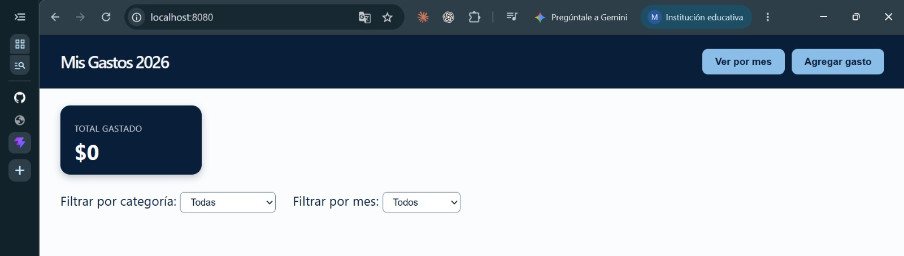
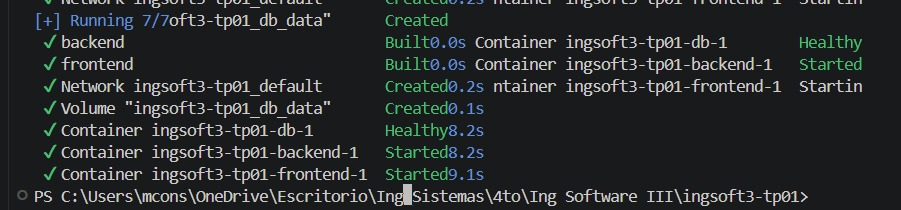
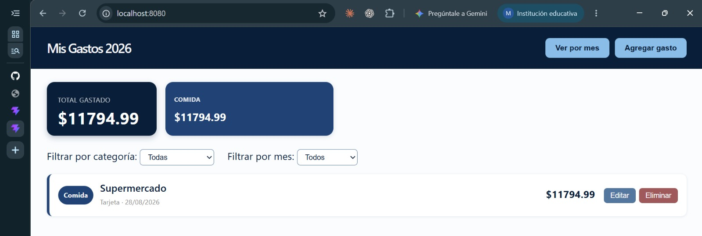
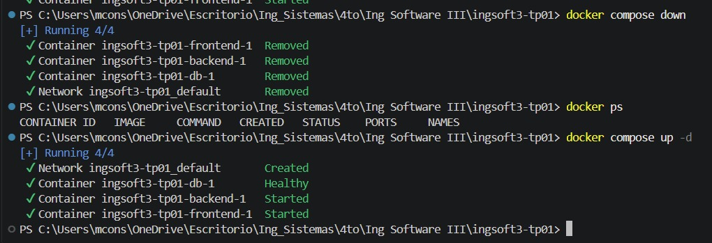
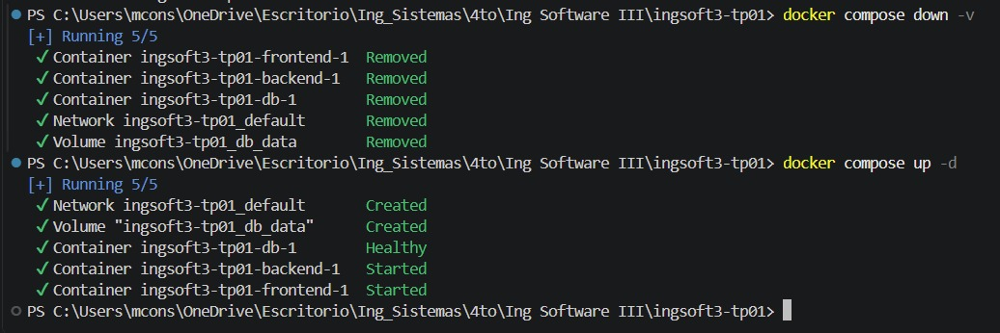
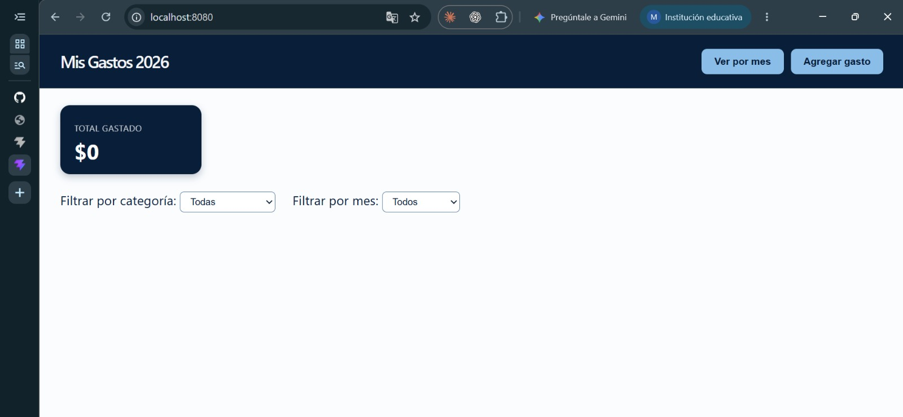
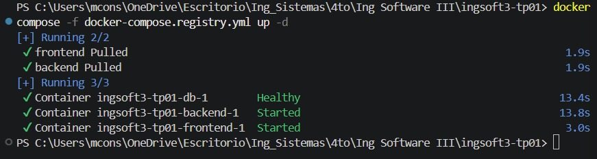
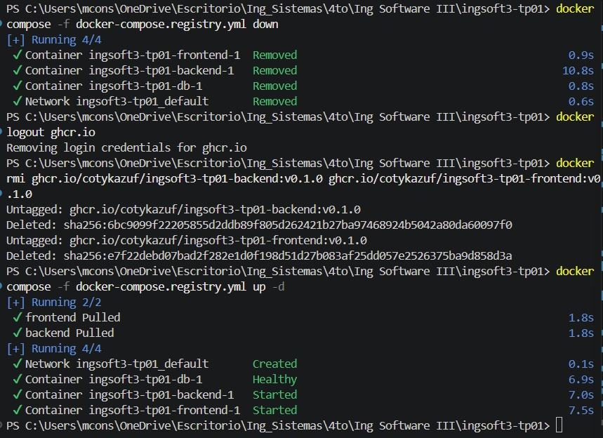

# Evidencias — TP1

## 1. Push directo a main rechazado

GitHub rechaza el push directo a la rama main porque está protegida y los cambios deben ingresar mediante Pull Request.

## 2. Conflicto de merge en el Pull Request

Luego de mergear la rama `feature/titulo-a`, el Pull Request de `feature/titulo-b` entra en conflicto porque ambas ramas modificaron la misma línea del README.

## 3. Marcadores del conflicto

Git muestra los marcadores `<<<<<<<`, `=======` y `>>>>>>>` para indicar las dos versiones que no puede combinar automáticamente.

## 4. Release v1.0.0 publicada

Se publica la primera versión estable del TP mediante el tag y la release `v1.0.0`.
## TP2

### 1. Build de la imagen del backend

Se construye la imagen `mi-backend:dev` a partir del Dockerfile multi-stage del backend (etapa `build` con `node:20` para instalar dependencias, etapa `final` con `node:20-alpine` para la imagen que se ejecuta). El build termina sin errores (14/14 pasos completados) y respeta el `.dockerignore`, que evita copiar `node_modules` y archivos sensibles como `.env` al contexto de build.

### 2. Contenedor del backend corriendo

Se levanta un contenedor a partir de `mi-backend:dev`, conectado a la base PostgreSQL que corre en el host mediante `host.docker.internal` (usando `--add-host=host.docker.internal:host-gateway`, necesario porque el contenedor y el host no comparten `localhost`). El backend queda escuchando en el puerto 3000, expuesto con `-p 3000:3000`.

### 3. Verificación del endpoint /health

Con el contenedor corriendo, se accede a `http://localhost:3000/health` desde el navegador y responde `{"status":"ok"}`, confirmando que el backend dockerizado levanta y se conecta correctamente a la base de datos.

### 4. Comparación de tamaño de imágenes

Se compara el tamaño de la imagen base completa de Node (`node:20`, 1.58GB) contra la base liviana usada en la etapa final (`node:20-alpine`, 193MB) y contra la imagen final del backend (`mi-backend:dev`, 200MB). Gracias al build multi-stage, la imagen final queda casi del mismo tamaño que la base alpine, sin arrastrar las herramientas de compilación que usa la etapa de build.

### 5. Frontend servido por nginx (contenedor suelto, sin red compartida)

Se construye la imagen `mi-frontend:dev` (build de Vite servido por nginx) y se levanta un contenedor solo, sin Docker Compose (`docker run -p 8080:80 mi-frontend:dev`). La interfaz carga correctamente en `http://localhost:8080`, pero el total y el listado quedan en $0 / vacío: el contenedor del frontend y el del backend no comparten red, así que el nombre `backend` que usa `nginx.conf` para el proxy todavía no resuelve a ninguna IP. Este comportamiento es el esperado en este punto — se resuelve recién en la Fase 8 (Docker Compose), cuando ambos servicios queden conectados a la misma red.

### 6. Sistema completo levantado con Docker Compose

Se ejecuta `docker compose up -d --build` en la raíz del repo. Compose construye las imágenes de `backend` y `frontend`, crea el volumen `ingsoft3-tp01_db_data` y levanta los 3 servicios definidos en `docker-compose.yml`. Gracias al `healthcheck` de `db` (`pg_isready`) combinado con `depends_on: condition: service_healthy` en `backend`, el contenedor de Postgres queda en estado `Healthy` antes de que arranquen `backend` y `frontend` (que quedan en `Started`), evitando que el backend intente conectarse a una base de datos que todavía no está lista para aceptar conexiones.

### 7. Aplicación funcionando de punta a punta con Docker Compose

Con los 3 contenedores levantados por `docker compose up -d --build`, se accede a `http://localhost:8080` y se agrega un gasto desde la propia interfaz. El dato se guarda correctamente: el navegador le habla a `frontend` (nginx), que reenvía el pedido `/api/...` al contenedor `backend` por el nombre de servicio `backend`, y este se conecta a la base de datos del contenedor `db`. Los gastos que existían antes en la base de Postgres local de Windows no aparecen — es esperado, ya que el servicio `db` de este `docker-compose.yml` es una base nueva y separada, con su propio volumen (`ingsoft3-tp01_db_data`), que arrancó vacía y solo con la tabla `gastos` creada por `backend/db/init.sql`.

### 8. Persistencia de datos: `docker compose down` sin `-v`

Se ejecuta `docker compose down` (sin `-v`), que borra los 3 contenedores y la red, pero deja intacto el volumen `ingsoft3-tp01_db_data`. Al volver a levantar el sistema con `docker compose up -d`, Postgres arranca sobre ese mismo volumen y encuentra los datos que ya existían: los gastos cargados antes de bajar el sistema siguen apareciendo en la aplicación. Esto confirma que el volumen declarado en `docker-compose.yml` cumple su función: los datos sobreviven a la eliminación de los contenedores.

### 9. Persistencia de datos: `docker compose down -v` (se pierden los datos)

Se ejecuta `docker compose down -v`, esta vez sí incluyendo la `-v`. El log confirma `Volume ingsoft3-tp01_db_data Removed`, a diferencia del `down` sin `-v` del punto anterior. Al volver a levantar el sistema con `docker compose up -d`, Postgres crea un volumen nuevo desde cero (con la tabla `gastos` vacía otra vez, por el `init.sql`), y la aplicación en `localhost:8080` no muestra ningún gasto. Contrastando este resultado con el del punto 8, queda demostrada la diferencia entre `docker compose down` (los datos sobreviven) y `docker compose down -v` (los datos se pierden junto con el volumen).

### 10. Publicación de las imágenes en GHCR

Se etiquetan y suben (`docker tag` + `docker push`) las imágenes `mi-backend:dev` y `mi-frontend:dev` a GitHub Container Registry, como `ghcr.io/cotykazuf/ingsoft3-tp01-backend:v0.1.0` y `ghcr.io/cotykazuf/ingsoft3-tp01-frontend:v0.1.0`. Para probar que el sistema puede levantar usando esas imágenes publicadas y no imágenes locales, se borran previamente todas las imágenes locales con esos nombres (`docker rmi`) y se levanta el sistema con `docker compose -f docker-compose.registry.yml up -d` — un compose donde `backend` y `frontend` usan `image:` en vez de `build:`. El log muestra `frontend Pulled` y `backend Pulled`, confirmando que las imágenes se descargaron de GHCR, y los 3 contenedores quedan `Healthy`/`Started`.

### 11. Las imágenes son realmente públicas (prueba sin login)

Para demostrar que las imágenes no solo son accesibles porque la sesión sigue autenticada, se repite la prueba en un escenario más estricto: `docker compose -f docker-compose.registry.yml down`, `docker logout ghcr.io` (elimina las credenciales guardadas), se borran de nuevo las imágenes locales, y se vuelve a correr `docker compose -f docker-compose.registry.yml up -d` **sin ninguna sesión iniciada en GHCR**. El resultado es idéntico: `frontend Pulled`, `backend Pulled`, todo arriba y sano. Esto confirma que ambas imágenes están configuradas como públicas en GHCR — cualquiera puede descargarlas sin necesitar acceso a la cuenta de GitHub del proyecto.
