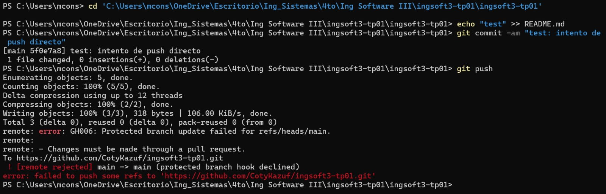
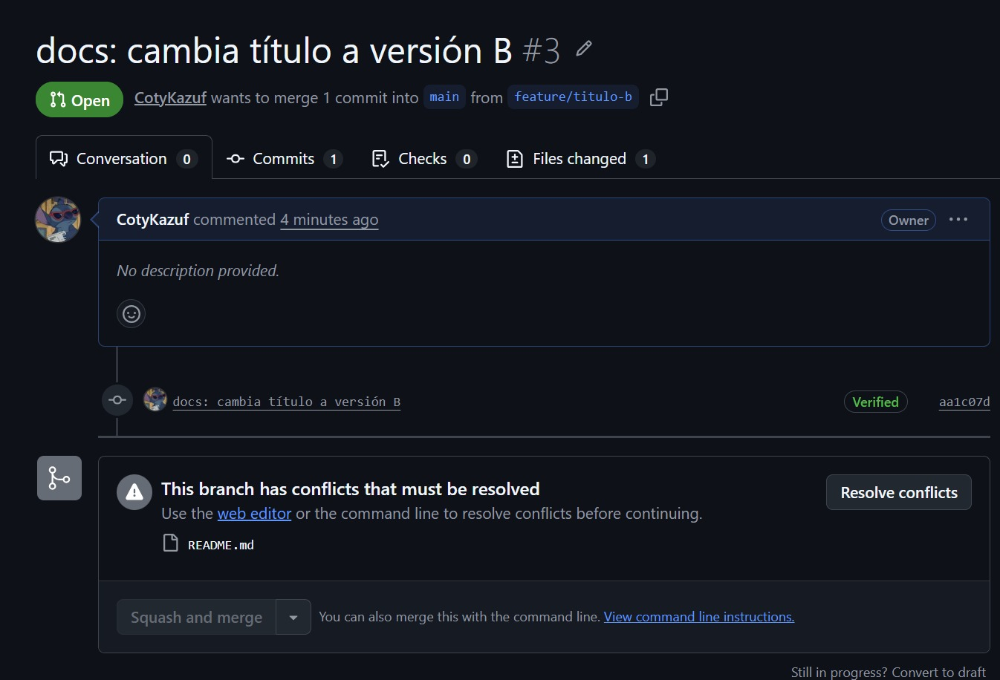
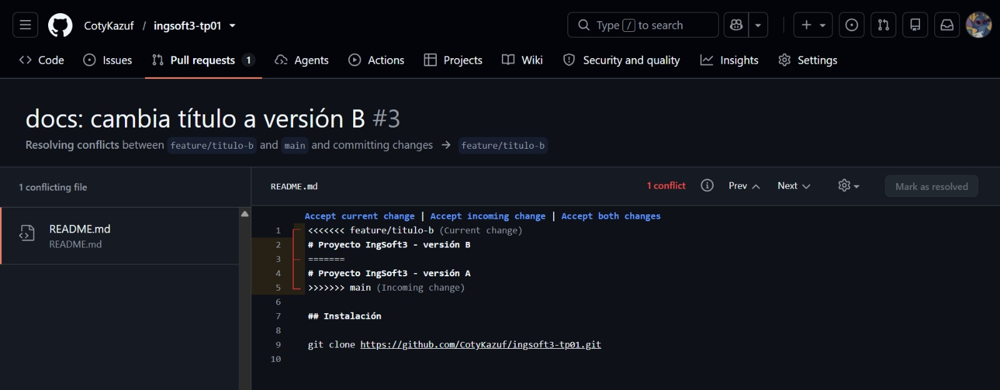
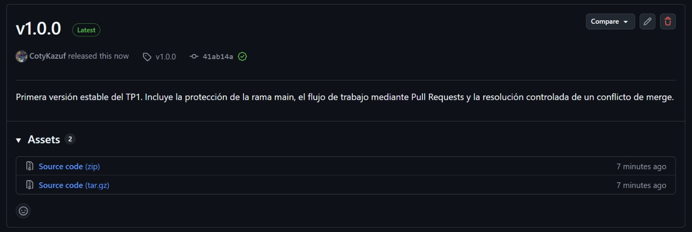
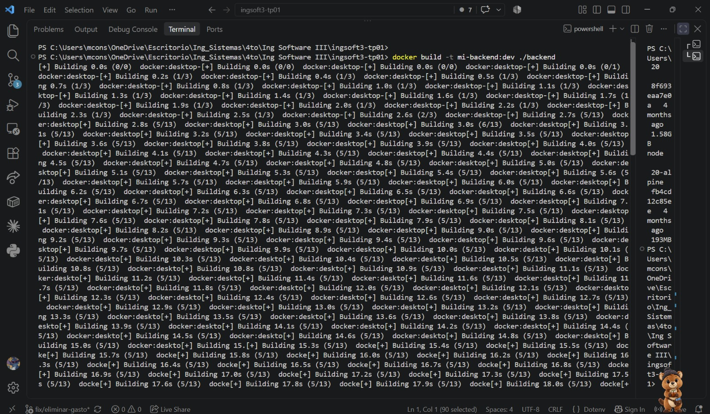
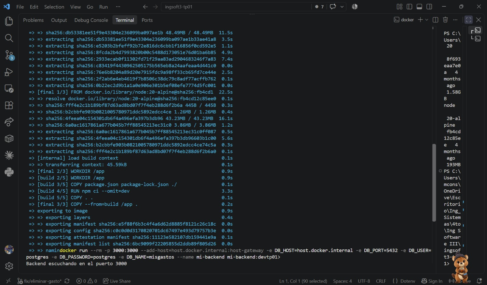
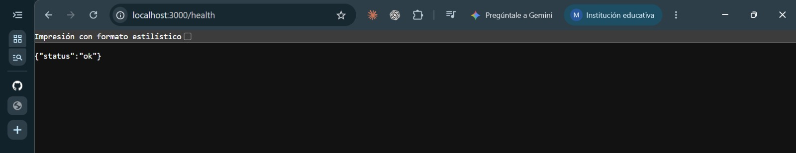
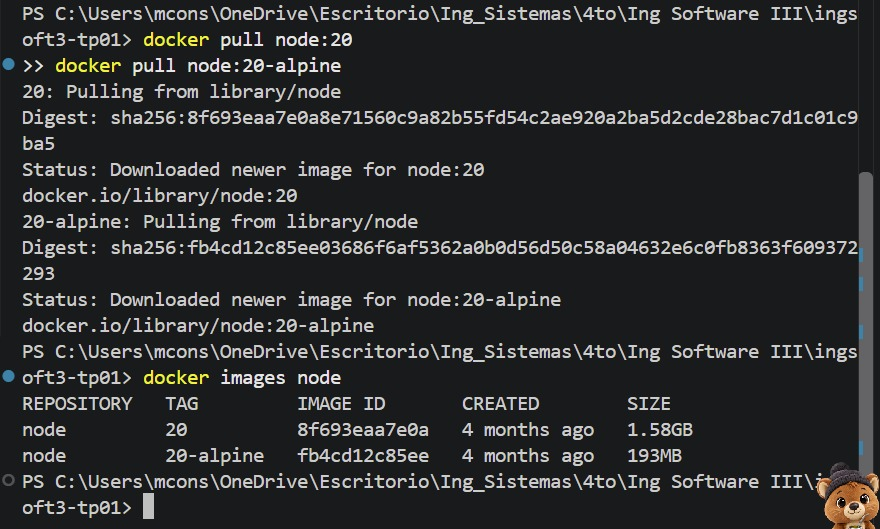
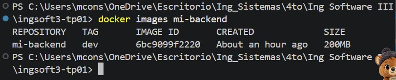

# Evidencias — TP1

## 1. Push directo a main rechazado

GitHub rechaza el push directo a la rama main porque está protegida y los cambios deben ingresar mediante Pull Request.

## 2. Conflicto de merge en el Pull Request

Luego de mergear la rama `feature/titulo-a`, el Pull Request de `feature/titulo-b` entra en conflicto porque ambas ramas modificaron la misma línea del README.

## 3. Marcadores del conflicto

Git muestra los marcadores `<<<<<<<`, `=======` y `>>>>>>>` para indicar las dos versiones que no puede combinar automáticamente.

## 4. Release v1.0.0 publicada

Se publica la primera versión estable del TP mediante el tag y la release `v1.0.0`.
## TP2

### 1. Build de la imagen del backend

Se construye la imagen `mi-backend:dev` a partir del Dockerfile multi-stage del backend (etapa `build` con `node:20` para instalar dependencias, etapa `final` con `node:20-alpine` para la imagen que se ejecuta). El build termina sin errores (14/14 pasos completados) y respeta el `.dockerignore`, que evita copiar `node_modules` y archivos sensibles como `.env` al contexto de build.

### 2. Contenedor del backend corriendo

Se levanta un contenedor a partir de `mi-backend:dev`, conectado a la base PostgreSQL que corre en el host mediante `host.docker.internal` (usando `--add-host=host.docker.internal:host-gateway`, necesario porque el contenedor y el host no comparten `localhost`). El backend queda escuchando en el puerto 3000, expuesto con `-p 3000:3000`.

### 3. Verificación del endpoint /health

Con el contenedor corriendo, se accede a `http://localhost:3000/health` desde el navegador y responde `{"status":"ok"}`, confirmando que el backend dockerizado levanta y se conecta correctamente a la base de datos.

### 4. Comparación de tamaño de imágenes

Se compara el tamaño de la imagen base completa de Node (`node:20`, 1.58GB) contra la base liviana usada en la etapa final (`node:20-alpine`, 193MB) y contra la imagen final del backend (`mi-backend:dev`, 200MB). Gracias al build multi-stage, la imagen final queda casi del mismo tamaño que la base alpine, sin arrastrar las herramientas de compilación que usa la etapa de build.
